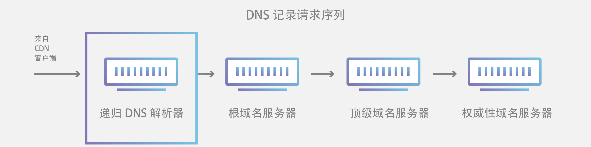
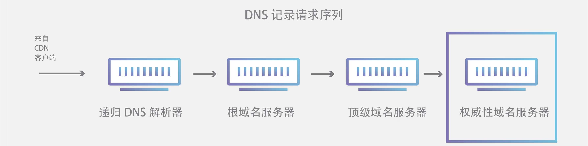
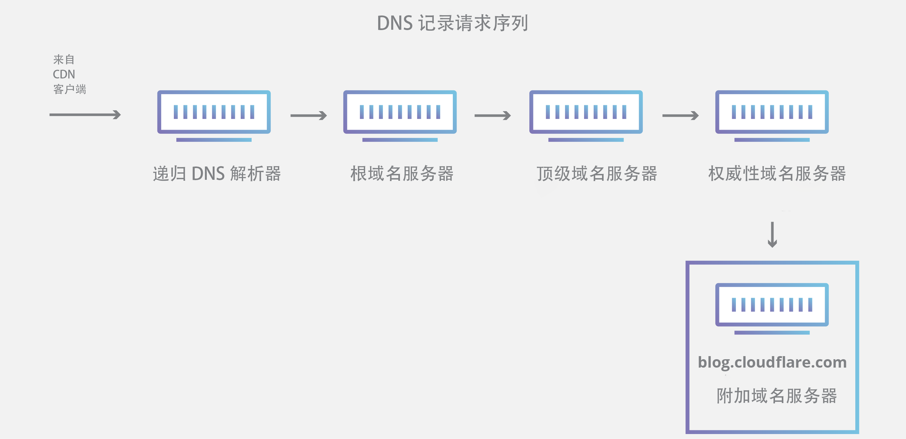
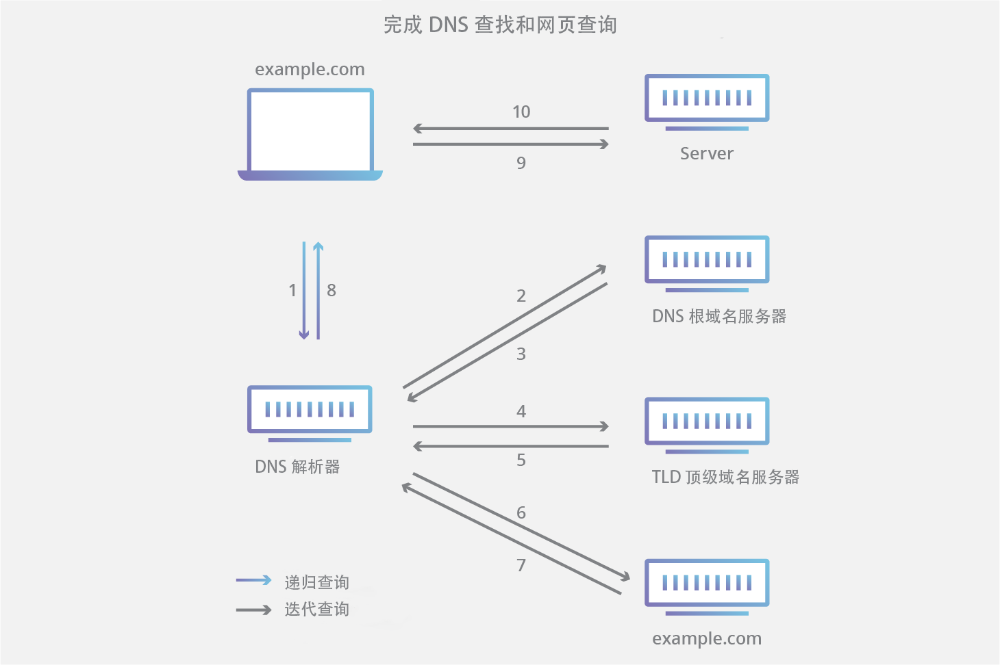

## 什么是DNS？
> DNS允许用户使用域名而不是IP地址来连接网站

域名系统（DNS）是互联网的电话簿。人们通过例如baidu.com或bilibili.com等域名在线访问信息。Web浏览器通过互联网协议（IP）地址进行交互。DNS将域名转换为IP地址，以便浏览器能否加载互联网资源。

连接到Internet的每个设备都有一个唯一IP地址，其他计算机可使用该IP地址查找此设备。DNS服务器是热门无需存储例如192.168.1.1（IPv4中）等IP地址或更复杂的脚心字母数字IP地址，例如2400:cb00:2048:1::c629:d7a2（IPv6）。

## DNS如何工作？

DNS解析过程涉及将主机名（例如www.example.com）转换为计算机友好的IP地址（例如192.168.1.1）。Internet上的每个设备都被分配了一个IP地址，必须有该地址才能找到相应的Internet设备-就像使用街道地址来查找特定住所一样。当用户想要加载网页时，用户在Web浏览器中键入的内容（example.com）与查找example.com网页所需的机器友好地址之间必须进行转换。

## 加载网页涉及4个DNS服务器：

* [DNS解析器](https://www.cloudflare.com/learning/dns/dns-server-types#recursive-resolver)-该解析器可被视为被要求去图书馆的某个地方查找特定图书馆的图书馆员。DNS解析器是一种服务器，旨在通过Web浏览器等应用程序接收客户端计算机的查询。然后，解析器一般负责发出其他请求，以便满足客户端的DNS查询。

* 根域名服务器-[根域名服务器](https://www.cloudflare.com/learning/dns/glossary/dns-root-server/)是将人类可读的主机名转换（解析）为IP地址的第一步。可将其视为指向不同书架的图书馆中的索引-一般其作为对其他更具体位置的引用。

* [TLD名称服务器](https://www.cloudflare.com/learning/dns/dns-server-types#tld-nameserver)----顶级域名服务器（[TLD](https://www.cloudflare.com/learning/dns/top-level-domain/)）可看作是图书馆中一个特殊的书架。这个域名服务器是搜索特定IP地址的下一步，其上托管了主机名的最后一部分（例如，在example.com中，TLD服务器为"com"）。

* [权威性域名服务器](https://www.cloudflare.com/learning/dns/dns-server-types#authoritative-nameserver)-可将这个最终域名服务器视为书架上的字典，其中特定的名称可被转换其定义。权威性域名服务器是域名服务器查询中的最后一站。如果权威性域名服务器能访问请求的记录，则其会将已请求主机名的IP地址返回到发出初始请求的DNS解析器（图书管理员）。

## 权威性DNS服务器与递归DNS解析器之间的区别是什么？

这两个概念都是指DNS基础设施不可或缺的服务器（服务器组），但各自担当不同的角色，并且位于DNS查询通道内的不同位置。考虑两者差异的一种方式是，[递归](https://www.cloudflare.com/learning/dns/what-is-recursive-dns/)解析器位于DNS查询的开头，而权威性域名服务器位于末尾。

### 递归DNS解析器

递归解析器是一种计算机，其响应来自客户端的递归请求并花时间追踪[DNS记录](https://www.cloudflare.com/learning/dns/dns-records/)。为执行此操作，其发出一系列请求，直至到达用于所请求的记录的权威性DNS域名服务器为止（或者超时，或者如果未找到记录，则返回错误）。幸运的是，递归DNS解析器并不是需要发出多个请求才能追踪响应客户端所需的记录；[缓存](https://www.cloudflare.com/learning/cdn/what-is-caching/)是一种数据持久性过程，可通过在DNS查找中更早地服务于所请求的资源记录来所需的请求提供捷径。

### 权威性DNS服务器

简言之，权威性DNS服务器是实际持有并负责DNS资源记录的服务器。这是位于DNS查找链底部的服务器，其将使用所查询的资源记录进行响应，从而最终允许发出请求的Web浏览器到达访问网站或其他Web资源所需的IP地址。权威性域名服务器从自身数据满足查询需求，无需查询其他来源，因为这是某些DNS记录的最终真实来源。

值得一提的是，在查询对象为子域（例如 foo.example.com或 [blog.cloudflare.com](https://blog.cloudflare.com/)）的情况下，将向权威性域名服务器之后的序列添加一个附加域名服务器，其负责存储该子域的[CNAME记录](https://www.cloudflare.com/learning/dns/dns-records/dns-cname-record/)

许多 DNS 服务与 Cloudflare 提供的服务之间存在一个关键区别。Google DNS、OpenDNS 等不同 DNS 递归解析器以及 Comcast 等提供商均保持 DNS 递归解析器的数据中心安装。这些解析器可实现通过 DNS 优化式计算机系统的优化群集快速轻松地进行查询，但它们与 Cloudflare 托管的域名服务器截然不同。

Cloudflare 维护 Internet 功能不可或缺的基础设施级域名服务器。一个主要示例是 Cloudflare 部分负责托管的 [f-根服务器网络](https://blog.cloudflare.com/f-root/)。F 根是每天负责数十亿个 Internet 请求的根级 DNS 域名服务器基础设施组件之一。我们的 [Anycast 网络](https://www.cloudflare.com/learning/cdn/glossary/anycast-network/)在处理大量 DNS 流量方面发挥着不可替代的作用，也不会出现服务中断。

## DNS查找有哪些步骤？

大多数情况下，DNS与正被转换为相应IP地址的域名有关。要了解此过程的工作方式，在DNS查找从Web浏览器经过DNS查找过程然后再返回时，跟踪DNS查找的路径会有所帮助。我们来看一下这些步骤。

注意：通常，DNS 查找信息将本地缓存在查询计算机内，或者远程缓存在 DNS 基础设施内。DNS 查找通常有 8 个步骤。缓存 DNS 信息时，将从 DNS 查找过程中跳过一些步骤，从而使该过程更快。以下示例概述了不缓存任何内容时的所有 8 个步骤。

### DNS查找的8个步骤：

1. 用户在Web浏览器中键入“example.com”，查询传输到Internet中，并被DNS递归解析器接收。
2. 接着，解析器查询DNS根域名服务器（.）。
3. 然后，根服务器使用存储其域信息的顶级域（TLD）DNS服务器（例如.com或.net）的地址响应该浏览器。在搜索example.com时，我们的请求指向.com TLD。
4. 然后，解析器向.com TLD发出请求。
5. TLD服务器随后使用该域的域名服务器example.com的IP地址进行响应。
6. 最后，递归解析器将查询发送到域的域名服务器。
7. example.com的IP地址而从域名服务器返回解析器。
8. 然后DNS解析器使用最初请求的域的IP地址响应Web浏览器。DNS查找的这8个步骤返回example.com的IP地址后，浏览器便发出对该网页的请求：
9. 浏览器向该 IP 地址发出 [HTTP](https://www.cloudflare.com/learning/ddos/glossary/hypertext-transfer-protocol-http/) 请求。

10. 位于该 IP 的服务器返回将在浏览器中呈现的网页（第 10 步）。

## 什么是DNS解析器？

DNS解析器是DNS查找的第一站，其负责与发出初始请求的客户端打交道。解析器启动查询序列，最终使URL转换为必要的IP地址。

注意：典型的未缓存DNS查找将涉及递归查询和迭代查询。

务必区分[递归DNS](https://www.cloudflare.com/learning/dns/what-is-recursive-dns/)查询和递归DNS解析器。该查询是指向需要解析查询的DNS解析器发出的请求。DNS递归解析器是一种计算机，其接受递归查询并通过发出必要的请求来处理响应。

## DNS查询有哪些类型？

典型DNS查找中会出现三种类型的查询。通过组合使用这些查询，优化的DNS解析过程可缩短传输距离。在理想情况下，可以使用缓存的记录数据，从而使DNS域名服务器能否返回非递归查询。

### 3种DNS查询类型:

1. **递归查询** - 在递归查询中，DNS 客户端要求 DNS 服务器（一般为 DNS 递归解析器）将使用所请求的资源记录响应客户端，或者如果解析器无法找到该记录，则返回错误消息。

2. **迭代查询** - 在这张情况下，DNS 客户端将允许 DNS 服务器返回其能够给出的最佳应答。如果所查询的 DNS 服务器与查询名称不匹配，则其将返回对较低级别域名空间具有权威性的 DNS 服务器的引用。然后，DNS 客户端将对引用地址进行查询。此过程继续使用查询链中的其他 DNS 服务器，直至发生错误或超时为止。

3. **非递归查询** - 当 DNS 解析器客户端查询 DNS 服务器以获取其有权访问的记录时通常会进行此查询，因为其对该记录具有权威性，或者该记录存在于其缓存内。DNS 服务器通常会缓存 DNS 记录，以防止更多带宽消耗和上游服务器上的负载。

## 什么是 DNS 高速缓存？DNS 高速缓存发生在哪里？

缓存的目的是将数据临时存储在某个位置，从而提高数据请求的性能和可靠性。DNS 高速缓存涉及将数据存储在更靠近请求客户端的位置，以便能够更早地解析 DNS 查询，并且能够避免在 DNS 查找链中进一步向下的额外查询，从而缩短加载时间并减少带宽/CPU 消耗。DNS 数据可缓存到各种不同的位置上，每个位置均将存储 DNS 记录并保存由[生存时间（TTL）](https://www.cloudflare.com/learning/cdn/glossary/time-to-live-ttl/)决定的一段时间。

### 浏览器DNS缓存

现代 Web 浏览器设计为默认将 DNS 记录缓存一段时间。目的很明显；越靠近 Web 浏览器进行 DNS 缓存，为检查缓存并向 IP 地址发出正确请求而必须采取的处理步骤就越少。发出对 DNS 记录的请求时，浏览器缓存是针对所请求的记录而检查的第一个位置。

在 Chrome 浏览器中，您可以转到 chrome://net-internals/#dns 查看 DNS 缓存的状态。

### 操作系统（OS）级 DNS 缓存

操作系统级 DNS 解析器是 DNS 查询离开您计算机前的第二站，也是本地最后一站。操作系统内旨在处理此查询的过程通常称为“存根解析器”或 DNS 客户端。当存根解析器获取来自某个应用程序的请求时，其首先检查自己的缓存，以便查看是否有此记录。如果没有，则将本地网络外部的 DNS 查询（设置了递归标记）发送到 Internet 服务提供商（ISP）内部的 DNS 递归解析器。

与先前所有步骤一样，当 ISP 内的递归解析器收到 DNS 查询时，其还将查看所请求的主机到 IP 地址转换是否已经存储在其本地持久性层中。

根据其缓存中具有的记录类型，递归解析器还具有其他功能：

1. 如果解析器没有 [A 记录](https://www.cloudflare.com/learning/dns/dns-records/dns-a-record/)，但确实有针对权威性域名服务器的 [NS 记录](https://www.cloudflare.com/learning/dns/dns-records/dns-ns-record/)，则其将直接查询这些域名服务器，从而绕过 DNS 查询中的几个步骤。此快捷方式可防止从根和 .com 域名服务器（在我们对 example.com 的搜索中）进行查找，并且有助于更快地解析 DNS 查询。
2. 如果解析器没有 NS 记录，它会向 TLD 服务器（本例中为 .com）发送查询，从而跳过根服务器。
3. 万一解析器没有指向 TLD 服务器的记录，其将查询根服务器。这种情况通常在清除了 DNS 高速缓存后发生。