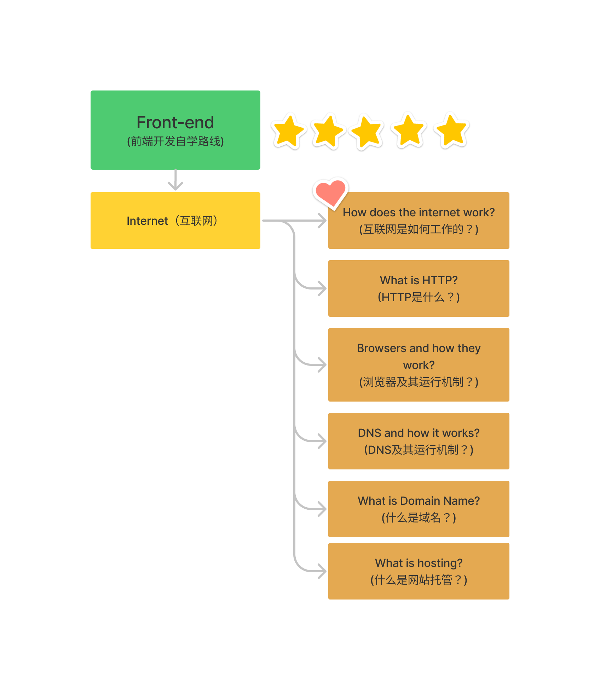

## 前端开发自学路线整理

学习资料：[roadmap.sh](https://roadmap.sh/)

前端开发自学资料：[前端学习路线图](https://roadmap.sh/frontend)

roadmap.sh 作者：在我继续列出资源之前，请记住，路线图和下面的列表是详尽无遗的，您不需要从一开始就知道所有内容。对于前端开发，您只需要学习一些基本的 HTML、CSS 和 JavaScript，然后开始从事项目；其他的一切都将在这个过程中学习。

> 正如资料所介绍的那样：在 2022 年，根据指导逐步成为一个合格的前端开发工程师。

因为我的基础差，所以我会先从 Internet 互联网的一些知识入手，然后再正式开始 `HTML`、`CSS`、`JavaScript`的学习。

